# SQLite across workers sharing one Wasm memory

## Abstract

With the `threadsafe` feature, workers that share one module and one `WebAssembly.Memory` each open their own SQLite connection and run queries in parallel. We measured seven workloads across six storage modes at 1 to 32 workers, in Chrome, Firefox, Node and Bun, plus WebKit on the shared database. Reads that do real work per statement scale well in every runtime. At 32 workers, range aggregates reach 17 to 20 times one worker's throughput, lookups inside one read transaction 12 to 17 times and sorts 7 to 13 times. Short autocommit statements do not scale. Lookups on a shared database run at 0.5 to 1 times one worker, full scans with `GROUP BY` slow to 0.3 times, and writes to one database fall to 0.1 times. Compared with what applications do today, one SQLite worker answering `postMessage` requests, own connections serve small lookups roughly ten times faster. With one worker, the threadsafe build costs 0 to 7 percent in Chrome and Node and 10 to 19 percent in Firefox and Bun. The largest remaining limit is Rust's global allocator lock. Swapping only the application's allocator for per-thread caches doubles sorts and full-text search at 32 workers.

## Setup

- **Machine.** AMD Ryzen Threadripper PRO 5975WX, 32 cores and 64 hardware threads, Linux 7.0, shared with other users (load average 2 to 25 during the runs).
- **Runtimes.** Headless Chrome 153, headless Firefox 156, Playwright's WebKit build 2248 (WPE MiniBrowser), Node 24.13.1 `worker_threads`, Bun 1.4.0 Web Workers.
- **Builds.** Nightly Rust 1.100 with `-Z build-std`, `+atomics`, shared memory up to 4 GiB, `wasm-bindgen` 0.2.128, SQLite 3.53.4, release profile, in four variants, `threadsafe`, `single` (`SQLITE_THREADSAFE=0` on the same shared memory), `cipher` (`threadsafe` with SQLite3MC) and `tcache` (`threadsafe` with a per-thread allocation cache as the Rust global allocator).
- **Database.** 100 000 rows of `(k INTEGER PRIMARY KEY, v INTEGER, s TEXT)` plus an FTS5 table of 100 000 eight-word documents, a warm page cache per connection.
- **Workloads.** Each has a fixed total split evenly across workers.

| Workload | Operation | Total |
| --- | --- | --- |
| point | `SELECT v FROM t WHERE k = ?` | 256 000 |
| range | `sum(v)` over 1 000 consecutive keys | 4 800 |
| scan | full scan with `GROUP BY v % 97` | 32 |
| sort | 2 000 rows `ORDER BY v DESC, s LIMIT 10` | 3 200 |
| fts | FTS5 `MATCH` on one word | 3 200 |
| insert | transactions of 50 `INSERT` rows | 9 600 (256 on OPFS) |
| mix | 90 percent point lookups, 10 percent single-row `UPDATE` | 160 000 (3 200 on OPFS) |

Point, range, sort and FTS also ran with each worker's whole share inside one read transaction.

- **Modes.** One shared memvfs database, one memvfs database per worker, one private `:memory:` database per worker, one OPFS `sahpool` per worker (Chrome and Firefox), SQLite3MC encryption on a shared and on per-worker databases, and NOMUTEX connections for the shared memvfs and `:memory:` modes. Every worker uses its own connection. The baseline instead has one worker own the connection and answer every other worker over `postMessage`.
- **Browser pages.** The runner serves every page with `Cross-Origin-Opener-Policy: same-origin` and `Cross-Origin-Embedder-Policy: require-corp`, which browsers require before a page can share memory with its workers, and the page refuses to start unless `crossOriginIsolated` is true.
- **Method.** Workers wait at a spin start line in shared memory, and a point is the span from the first start to the last finish. Each point has one warm-up and seven measured rounds. Figures show the median with the interquartile range as a band, and markers are hollow where the third quartile exceeds twice the first.

## Results

### Own connections against one serving worker

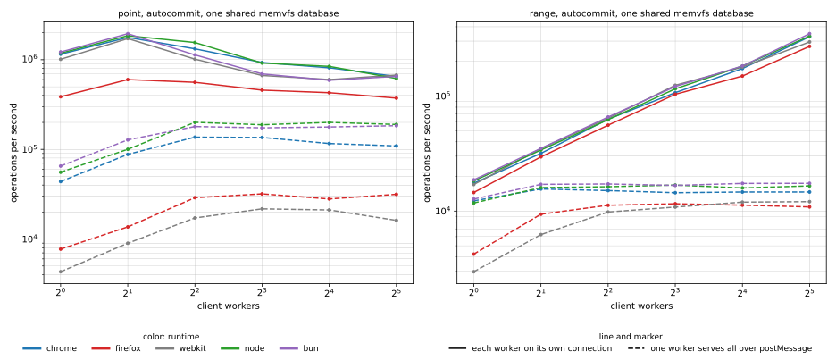

For autocommit lookups on the shared database, own connections sustain about 0.6 to 1.9 million lookups per second in Chrome, Node, Bun and WebKit. One serving worker levels off near 0.2 million, since every query pays a message round trip. Range aggregates scale with own connections and stay flat through one serving worker.

### One shared memvfs database

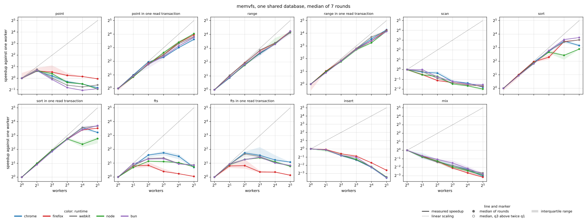

Range and sort scale in every runtime, and lookups scale once they share one read transaction. Autocommit lookups, scans, inserts and the mix get slower as workers are added. A shared database admits one writer at a time, and every autocommit statement takes the file's locks.

### One memvfs database per worker and private `:memory:` databases

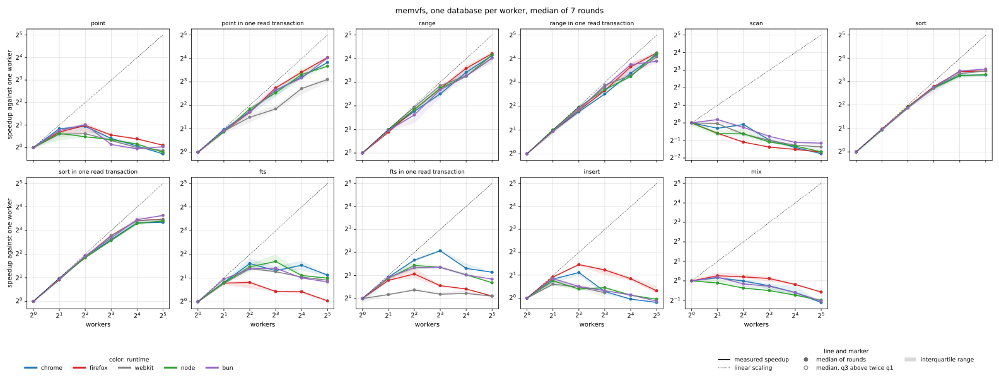

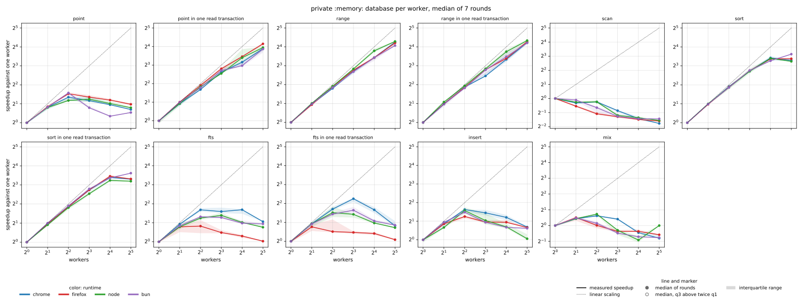

Separate databases remove the writer lock, so inserts reach about 1 to 2.7 times at 8 and 32 workers. Autocommit lookups still stop near 1.5 to 2 times even on private `:memory:` databases that share no SQLite state, which points at process-wide costs rather than database locks.

### SQLite3MC encryption

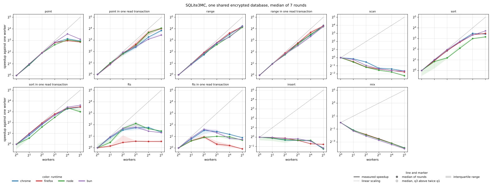

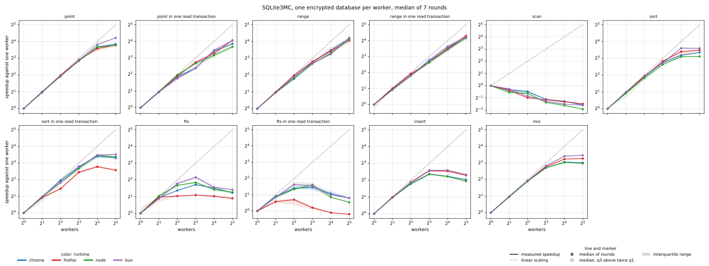

Each autocommit read decrypts again, so one worker needs 5 to 8 seconds for 256 000 lookups against 0.12 to 0.21 seconds inside one read transaction. That cipher work runs in parallel, reaching 7 to 9 times on a shared database and 14 to 19 times with one database per worker.

### OPFS `sahpool`, one pool per worker

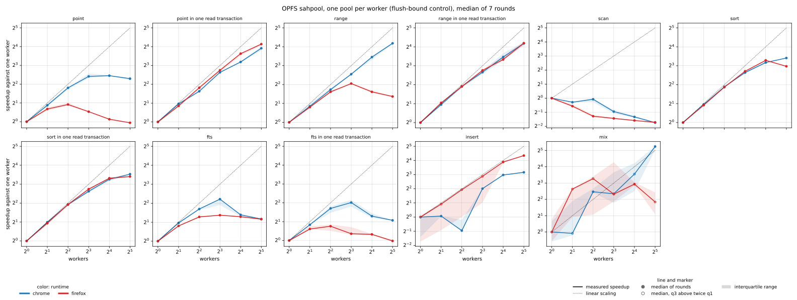

Each worker owns its pool, so this mode exercises no SQLite locking and serves as the platform's ceiling. Reads match memvfs. Every commit waits for a disk flush, which bounds inserts, and independent pools flush in parallel (8.9 times in Chrome and 20 times in Firefox at 32 workers).

### NOMUTEX connections

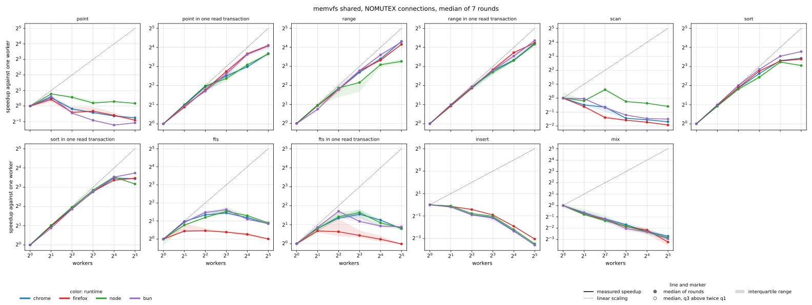

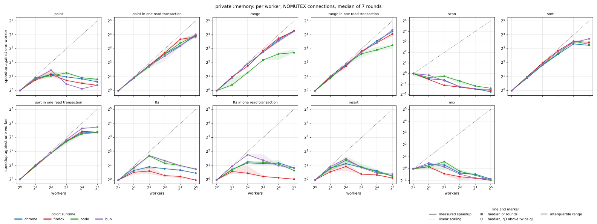

Dropping the per-connection mutex makes no consistent difference, since each connection stays on one worker and its mutex is uncontended.

### Cost with one worker

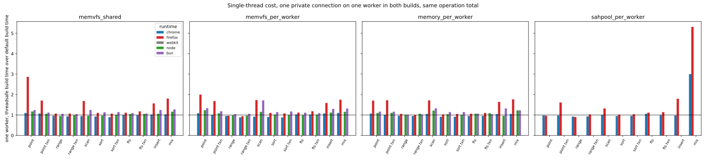

Both builds run one private connection on one worker. The median ratio of the threadsafe build's time over the default build's time is 0.96 to 1.01 in Chrome, 1.02 to 1.07 in Node, 1.14 to 1.17 in Bun and 1.10 to 1.19 in Firefox. Firefox's worst single workload is 2.9 times.

### Allocator and memory statistics

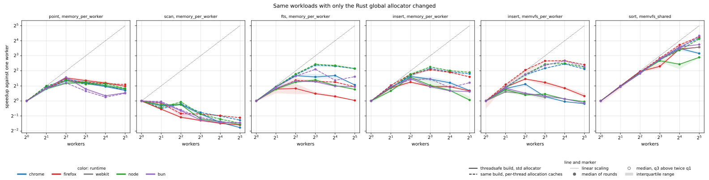

Changing only the Rust global allocator to per-thread caches of small blocks lifts sorts from 9 to 13 times to 17 to 21 times at 32 workers, full-text search from about 2 to 4.4 times in Chrome and Node, and memvfs inserts with one database per worker from about 1 to 4.3 to 5.3 times. Scans stay below one worker's speed.

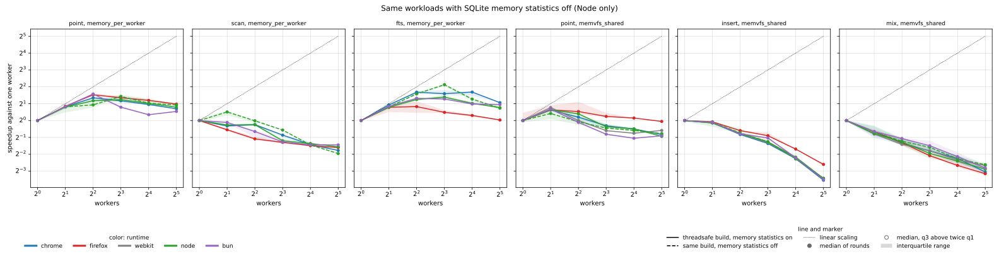

In Node, turning `SQLITE_CONFIG_MEMSTATUS` off lifts full-text search at 8 workers from about 2.2 to 4.3 times and sorts at 32 workers from 9.4 to 13.1 times. Full-text search at 32 workers and the other workloads stay about where they were. This run had an outside load near 20, so it is weaker evidence than the allocator comparison.

### SQLCipher

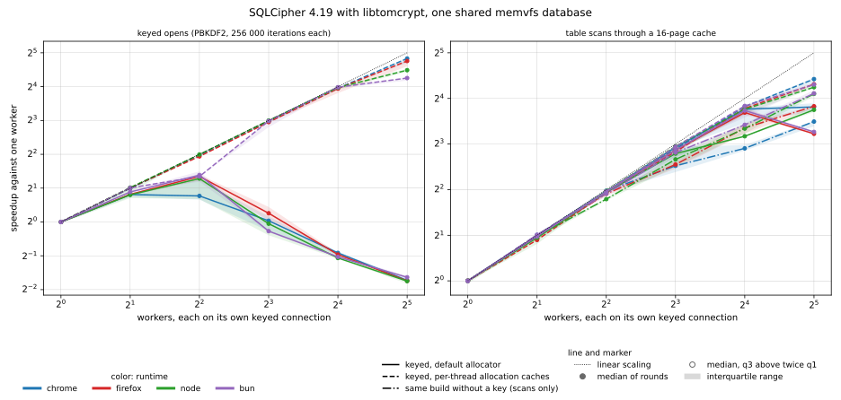

SQLCipher 4.19 with its libtomcrypt provider, built through `SQLITE_WASM_RS_SOURCE_DIR` on one shared keyed database with default settings (256 000 PBKDF2 iterations). One keyed open costs 0.66 to 0.74 seconds. Parallel opens gain up to 2.6 times at 4 workers and then fall to 0.3 times at 32, because libtomcrypt allocates and frees two buffers on every PBKDF2 iteration and each of those takes the global allocator lock. With per-thread allocation caches the same opens scale 19 to 28 times at 32 workers. Decryption is about 80 percent of a cold table read and scales 9.5 to 14 times at 32 workers, or 19 to 21.5 times with per-thread caches.

## Caveats

- Runtimes ran in separate sessions over about 11 hours under varying outside load. Curves within one runtime ran back to back and compare well. Ratios between runtimes are not controlled comparisons.
- WebKit reports 8 CPUs and has no OPFS. After its shared-database runs, its workers stopped delivering messages while shared memory grew. Reserving 1 GiB of heap up front avoided that, so it is attributed to that WebKit build, and its other modes were not measured.
- The `single` build still uses shared memory, so the single-thread cost isolates SQLite's mutexes and memvfs locking from atomics code generation.

Full per-point tables are in [benchmarks/tables.md](benchmarks/tables.md) and medians, quartiles and source files in [benchmarks/summary.csv](benchmarks/summary.csv).

## Reproducing

The harness is in [examples/threadsafe-bench](examples/threadsafe-bench). Build with `./build.sh`, run `node run-native.mjs`, `bun run-native.mjs` and `node run-browser.mjs chrome` (or `firefox`, `webkit`), then `python3 analyze.py`. A full matrix takes about one hour per runtime.

## Conclusions

- The `threadsafe` feature makes parallel reads practical. Queries that do real work per statement, or share one read transaction, scale 12 to 20 times at 32 workers in every runtime.
- Short autocommit statements and writes to one database do not scale, so write-heavy or one-row-per-statement applications gain little.
- Against one worker serving everyone over `postMessage`, own connections win by about ten times on small queries even before adding workers.
- SQLCipher's key derivation and page decryption parallelize almost linearly, but only with a thread-caching allocator. With the default one, parallel keyed opens are slower than one worker beyond four workers.
- The cost with one worker is small, and applications can raise the ceiling further with a scalable global allocator.
